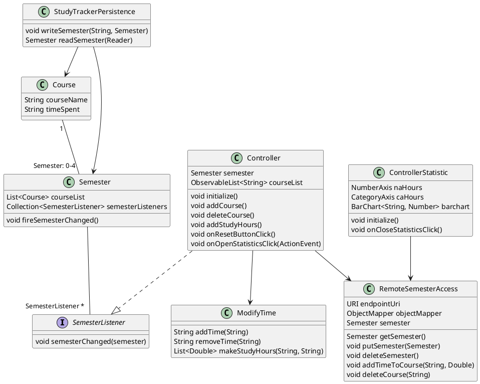
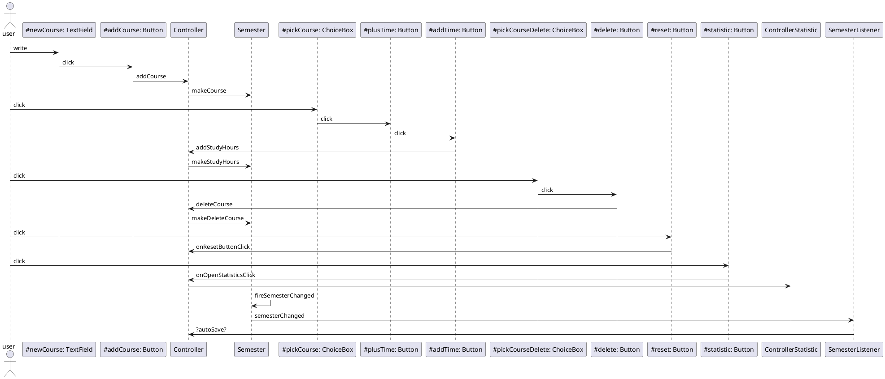
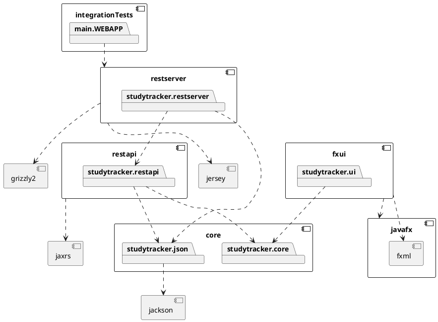

# Studytracker
=====

Vårt prosjekt omhandler appen StudyTracker. I appen skal brukeren kunne legge inn fag, og sette antall timer man jobber med hvet enkelt fag.
Appen er en trelagsapplikasjoen som består av domenelag, brukergrensesnitt og persistens. 

## Organisering av koden
Prosjektet er organisert i 5moduler, fxui,core, integrationTests, restApi og restServer. FXUI,core, restserver og integrationTests har to kildekodemapper, en for koden(main)
og en for testene. Restapi har ikke en kildekodemappe for tester, da denne blir testet av testene som ligger i restserver sin testkode. 

Fxui:
- **fxui/src/main/java/studytracker/ui** for controllere og App.java samt tilhørende hjelpeklasser. 
- **fxui/src/main/resources/studytracker/ui** for FXML-filen.
- **fxui/src/test/java** for testkoden til Controlleren og App.java.
- **fxui/src/test/resources** for en enklere kopi av fxml-filen som brukes i testene til Controlleren og App.java.

Core:
- **core/src/main/java/studytracker/core** for Semester og Course klassene.
- **core/src/main/java/studytracker/json** for Serializer, og Deserializer klassene for å håndtere fillagring via JSON og Jackson.
- **core/src/test** for testkoden til JSON, Semester og Course klassene.

IntegrationTests:
- **IntegrationTests/src/main/WEBAPP** for å starte serveren.
- **IntegrationTests/src/Test** for testing av serveren.

Restserver:
- **restserver/src/main/java/studytracker/restserver** for servervedlikehold.
- **restserver/src/resources/studytracker/restserver** for JSON-filene.
- **restserver/src/test/** for testkoden til både restserver og restapi.

Restapi:
- **restapi/src/main/** for behandling av serverRequest, POST,GET,DELETE,PUT.

### Domenelaget

Vår app handler om å kunne legge til fag man har et semester og hvor manage timer man bruker på å jobbe med faget. Man skal kunne oppdatere timeestimatet hele tiden. For å
håndtere tilhørende informasjon har vi Course og Semseter klasser. Disse ligger i [core.java.studytracker.core](https://gitlab.stud.idi.ntnu.no/it1901/groups-2020/gr2066/gr2066/-/tree/master/IT1901%2Fcore%2Fsrc%2Fmain%2Fjava%2Fstudytracker%2Fcore).

I domenelaget har vi klassene som omhandler logikk og objektene som applikasjoenen bruker. Dette laget fungerer uavhengig av resten av koden. 

### Brukergrensesnittlaget

I brukergrensesnittlaget har vi klasser og logikk som er knyttet opp mot visning av appen,
samt håndtering av informasjon brukeren legger inn. I vår app handler dette om å vise brukeren hvilke fag som er lagt inn, og hvor mye tid man har brukt på hvert fag. Det er 
også mulig å se statistikk over hvor mye tid man bruker på hvert fag. 
I brukergrensesnittlaget ligger også koden for å håndtere inputs fra brukeren. Koden til kjøringen av appen og kontrolleren finnes i [fxui.java.studytracker.ui](https://gitlab.stud.idi.ntnu.no/it1901/groups-2020/gr2066/gr2066/-/tree/master/IT1901%2Ffxui%2Fsrc%2Fmain%2Fjava%2Fstudytracker%2Fui).
Koden til fxml-filen finnes i [fxui.resources.studytracker.ui](https://gitlab.stud.idi.ntnu.no/it1901/groups-2020/gr2066/gr2066/-/tree/master/IT1901%2Ffxui%2Fsrc%2Fmain%2Fresources%2Fstudytracker%2Fui).


### Persistenslaget

I persistenslaget ligger klasser og logikk tilknyttet lagring og lesing fra fil. Filhåndteringen håndteres av JSON med Jacksonbibilioteket. 
Course og Semester har sine Serializers og Deserializers klasser som beskriver hvordan man skal skrive og lese objektene fra html-format. De finnes i [core.java.studytracker.json](https://gitlab.stud.idi.ntnu.no/it1901/groups-2020/gr2066/gr2066/-/tree/master/IT1901%2Fcore%2Fsrc%2Fmain%2Fjava%2Fstudytracker%2Fjson).

Via JSON har vi valgt implisitt lagring i stedet for dokumentmetafor. Det er mest funksjonelt for appen vår fordi brukeren kun har et semester å forholde seg til om gangen.
Dokumentmetafor med mulighet for å bytte mellom ulike semestere er unødvendig og vil få brukeren til å få flere ting å forholde seg til. Med implisitt lagring blir appen
enklere og mer brukervennlig.

### Serverlaget

I serverlaget ligger klasser og logikk tilknyttet lagring og henting av informasjon fra server. Serveren kjøres med jetty. Koden ti serveren finnes i
[resterver/java/studytracker/restserver](https://gitlab.stud.idi.ntnu.no/it1901/groups-2020/gr2066/gr2066/-/tree/master/IT1901/restserver/src/main/java/studytracker/restserver).FXUI har remoteSemesterAccess-klassen som 
sender http-request til serveren. Dette går via restapi, som er modulen som behandler slike forsespørsler. Koden for hvordan vi behandler du ulike forespørselene ligger i 
[restapi/java/studytracker/restapi](https://gitlab.stud.idi.ntnu.no/it1901/groups-2020/gr2066/gr2066/-/tree/master/IT1901/restapi/src/main/java/studytracker/restapi)


## plantUML diagramkode

Trykk på bildeikonet for å åpne diagrammet:

```plantuml
component core {
    package studyTracker.core{
        [Course]
        [Semester]
    }
    package studyTracker.json
}

component jackson{
}

studyTracker.json ..> jackson

component fxui {
    package studyTracker.fxui
}

studyTracker.fxui ..> studyTracker.core
studyTracker.fxui ..> studyTracker.json

component javafx{
    component fxml{
    }
}

fxui ..> javafx

[Course] ..> [Semester] : owner:1
[Semester]..> [Course] : 0-4
```

## plantUML klassediagram utkast1

### plantUML sekvensdiagram


### plantUML diagram for pakkeløsning

