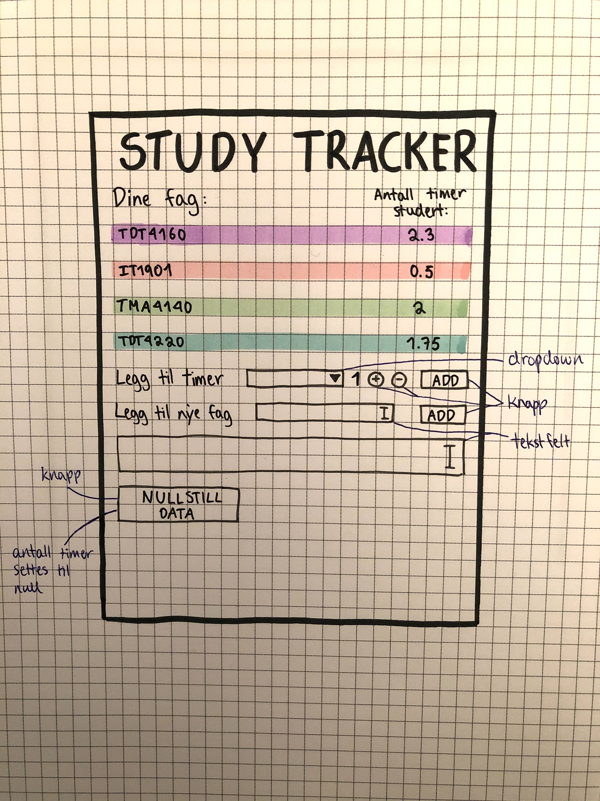

Applikasjonen skal kunne registrere fag, som legges til databasen. 

Man kan også til enhver tid se antallet timer brukeren har studert per fag, og legge til/trekke fra timer.

Det skal være mulig å nullstille all data, slik at antall timer studert i alle fag = 0 (nyttig når man starter en ny uke / ny studieperiode)

